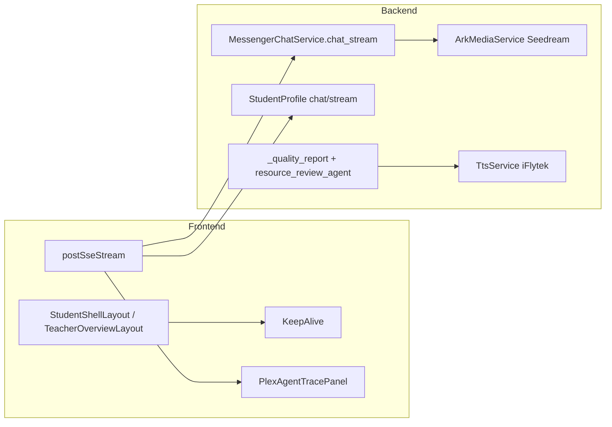

# 2026-07-29 技术沉淀：流式体验、资源自动审批与多模态接入

日期：2026-07-29  
分支：`codex/multi-ai-assistents`  
范围：学生端跳转性能、小E/画像流式对话、资源 AI 审核自动发布、火山 Seedream 生图、讯飞 TTS

## 1. 背景与目标

当日演示与联调暴露三类体验问题：

1. **页面跳转卡顿**：学生/教师每次换页重建整壳（侧栏、顶栏、通知轮询）。
2. **小E / 对话式画像「无回复」或极慢**：快捷按钮走非流式整包等待；画像 SSE 在 LLM 抽完前几乎不吐字；流式气泡空内容时几乎不可见。
3. **资源「38 项待教师审核」**：软风险（如 `low_confidence`、模板 `audit_syntax`）被级联打成 `pending_review + is_anomaly`，学生感觉「不能立刻学」。

同步完成多模态接入：火山方舟 Seedream 5.0 生图、讯飞在线 TTS；**不接视频模型**。

## 2. 架构结论



## 3. 页面跳转性能

### 做法

- 学生路由嵌套 [`StudentShellLayout.vue`](../frontend/src/layouts/StudentShellLayout.vue)：常驻 `DashboardShell` + `KeepAlive`（`exclude` 练习页）。
- 教师侧同理 [`TeacherOverviewLayout.vue`](../frontend/src/layouts/TeacherOverviewLayout.vue)。
- 子页通过 `layoutHost` / chrome composable 只更新标题导航，不再销毁侧栏。
- 通知轮询改为模块级单例 [`useStudentNotificationSync.ts`](../frontend/src/composables/useStudentNotificationSync.ts)。
- 首页 `loadOverview(false)` 尊重 TTL；回跳 `onActivated` 软刷新不闪 loading。
- Vite `manualChunks`：`ui` / `charts` / `monaco` / `g6` / `vue-vendor`。

### 注意

- `KeepAlive` 必须**始终挂载**并用 `exclude`，禁止 `v-if` 切掉整表缓存。

## 4. 小E 驿站对话

### 问题

- 快捷按钮原走 `messengerQuickAction` 非流式 → 长时间「正在思考」。
- 流式路径在 `done` 前同步生图（最长约 120s）拖死收尾。
- 空助手气泡无占位文案，看起来像「没回复」。

### 修复

| 层 | 改动 |
|---|---|
| 前端 | 快捷按钮统一 `streamMessengerChat`；可折叠思考过程；等待态固定「正在组织回答…」；`onDone` 立刻落字 |
| API | SSE 35s 超时；支持 `stage` / `illustration`；图解不阻塞文字返回 |
| 后端 | `chat_stream` 先 `stage` 再 delta；图解移到 `done` 之后；生图超时约 8s；规则兜底保证非空 reply |

关键文件：

- [`frontend/src/views/MessengerView.vue`](../frontend/src/views/MessengerView.vue)
- [`frontend/src/api/messenger.ts`](../frontend/src/api/messenger.ts)
- [`frontend/src/api/sse.ts`](../frontend/src/api/sse.ts)
- [`backend/app/services/messenger_chat.py`](../backend/app/services/messenger_chat.py)

## 5. 对话式画像

### 问题

SSE 名不副实：先同步 `LearningProfileAgent`（星火/LLM 可达数十秒）再吐字；前端空气泡 + 无超时。

### 修复

1. 路由先 `skip_llm=True` 规则快抽并立刻 `delta`。
2. 再短超时（约 7s）LLM enrichment。
3. Agent `analyze(..., timeout_seconds=)` 可缩短。
4. 前端：流式占位、30s Abort、快捷 starter 直接发送、错误 `message.error`。

关键文件：

- [`backend/app/routes/student_profile.py`](../backend/app/routes/student_profile.py)
- [`backend/app/services/student_profile.py`](../backend/app/services/student_profile.py)
- [`backend/agents/learning_profile_agent.py`](../backend/agents/learning_profile_agent.py)
- [`frontend/src/views/StudentProfileView.vue`](../frontend/src/views/StudentProfileView.vue)

## 6. 资源 AI 审核：正常自动批，仅硬异常进教师

### 裁决规则

硬风险（进教师异常区 / `pending_review + is_anomaly`）：

- `safety_blocked` / `out_of_scope` / `ai_reject`
- 严重 audit：`fantasy` / `unsafe` / `hallucin` / `injection` / `safety`

软风险（**不挡**学生立刻可见，可 `approved`）：

- `low_confidence`、`schema_invalid`、`audit_syntax`、题量类 FAIL 等

实现要点：

- [`_quality_report`](../backend/app/services/personalized_resource.py) 按硬/软分流。
- [`is_hard_risk`](../backend/agents/resource_review_agent.py) 统一判定。
- 去掉 `extended_reading` 故意压 `confidence=0.75` 的演示拦截。
- `release_soft_pending()` 用于存量放行；当日将 38 条中 30 条放行，8 条含 `ai_reject` 保留。
- 学生页横幅改为「异常待关注」，不再用「N 项待教师审核」吓人。

## 7. 多模态接入（无视频）

| 能力 | 配置 | 服务 |
|---|---|---|
| 文生图 | `ARK_API_KEY` + `ARK_IMAGE_MODEL=doubao-seedream-5-0-pro-260628`，`size=2K` | [`ark_media.py`](../backend/app/services/ark_media.py) |
| 语音讲解 | `IFLYTEK_TTS_APP_ID/API_KEY/API_SECRET` | [`tts_service.py`](../backend/app/services/tts_service.py) |
| 视频 | **不配置** `ARK_VIDEO_MODEL` | — |

`.env.example` 已补充占位；密钥仅写本地 `.env`，禁止入库。

## 8. 流水线智能体与分 Key

- 画像 / 知识检索 / 教学设计 / 路径规划 / 审核可使用独立 OpenAI Key（见 `.env.example`）。
- [`resource_pipeline_agents.py`](../backend/agents/resource_pipeline_agents.py)：真参考画像字段与课程知识，再生成资源。

## 9. 验证

- `unittest`：`test_resource_review_agent`、`test_demo_readiness`、`test_personalized_resources` 等通过。
- `vue-tsc --noEmit` 通过。
- 后端 `/api/v1/health` 正常。
- 手测建议：侧栏连点、驿站「推荐下一试炼」、画像 starter、资源列表异常计数。

## 10. 后续建议

1. 修复本地模板全角标点导致的 `audit_syntax` 误报，减少软风险噪声。
2. 教师端一键 `smart_review` 与 `release_soft_pending` 按钮产品化。
3. 驿站快捷动作可按 action 注入更强的推荐题 `question_pick`（当前统一自由聊流式）。
4. 轮换聊天中暴露过的 API Key。

## 11. 关键路径速查

```
frontend/src/layouts/StudentShellLayout.vue
frontend/src/layouts/TeacherOverviewLayout.vue
frontend/src/views/MessengerView.vue
frontend/src/views/StudentProfileView.vue
frontend/src/views/StudentResourcesView.vue
frontend/src/api/sse.ts
frontend/src/api/messenger.ts
backend/app/services/messenger_chat.py
backend/app/services/personalized_resource.py
backend/app/services/ark_media.py
backend/app/services/tts_service.py
backend/agents/resource_review_agent.py
backend/agents/resource_pipeline_agents.py
backend/.env.example
```
