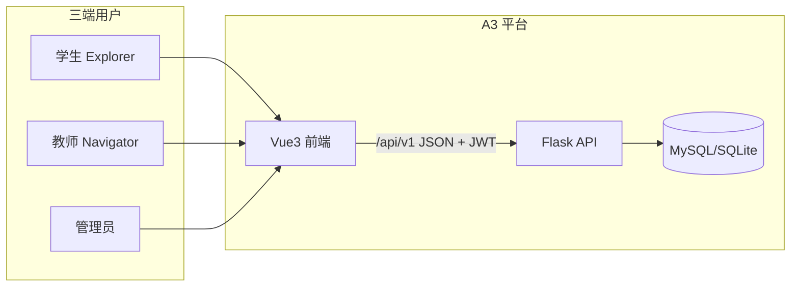
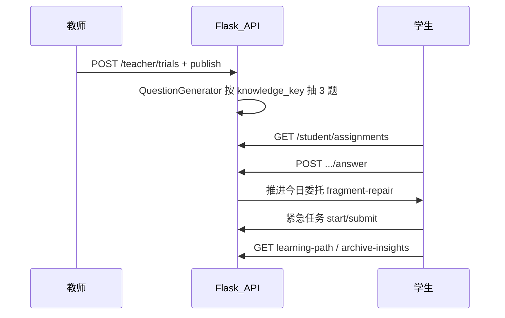

# A3 / PLEX 个性化学习系统 — 答辩项目说明

**文档版本**：2026-05-27  
**适用场景**：毕业设计 / 课程答辩 / 项目路演  
**配套答辩站**：PPPLEX（`ppplex/`，只读导航，不侵入业务路由）

---

## 名称对照

| 名称 | 含义 |
|------|------|
| **A3** | 项目代号，见仓库根目录 `TECH_PLAN.md` |
| **正式题名** | 基于大模型的个性化资源生成与学习多智能体系统 |
| **PLEX** | 学生端游戏化 UI 世界观（探索舱、星轨、试炼等），侧栏品牌名为 `PLEX` |
| **PPPLEX** | Presentation Plex — 答辩专用轻量展示站（`ppplex/`） |

---

## 一、项目一句话与答辩开场（约 30 秒）

**问题**：传统编程教学缺少个性化反馈、学习动机不足，教师难以及时掌握班级薄弱点与完成度。

**方案**：建设前后端分离的智能学习平台 A3，以游戏化「宇宙探索」叙事承载学习路径；教师发布试炼、学生完成任务并获得成长反馈；技术路线规划接入大模型与多智能体协同（见 `TECH_PLAN.md` 第四～五阶段）。

**当前阶段**：第一阶段「基础管理系统」已基本完成，并落地学生探索链路 MVP、教师工作台聚合接口；**题目生成当前为规则题库随机，尚未接入大模型生产链路**（答辩时需主动说明，避免「名不副实」）。

**建议开场白**：

> 我们的系统是 A3 个性化学习平台，学生端叫 PLEX 宇宙。教师发布知识点试炼后，学生会收到待修复碎片和今日委托题目；系统还能根据薄弱点推送紧急补给任务，并在星轨路径上展示六大学域的学习进度。目前已完成 Flask + Vue 三端闭环，AI 与多智能体在路线图中。

---

## 二、系统定位与目标用户

### 2.1 三端角色

| 角色 | 代号/称谓 | 主要职责 |
|------|-----------|----------|
| 学生 | Explorer 探索者 | 学习、完成试炼与委托、查看成长档案 |
| 教师 | Navigator 领航员 | 班级总览、发布试炼、观测学情、管理 Explorer |
| 管理员 | — | 系统设置、权限与全局配置（`/admin`） |

### 2.2 架构关系（概念图）



### 2.3 学生端模块与路由

| 中文名 | 路由 | 说明 |
|--------|------|------|
| 学生首页 | `/student` | 等级、积分、委托进度、成就摘要 |
| 探索舱 | `/student/discovery` | 探索起点，星图、待修复碎片、补给站入口 |
| 星轨路径 | `/student/star-path` | 六大学域知识点导航与内嵌编程试炼 |
| 试炼关卡 | `/student/trials` | 班级试炼列表与参与 |
| 驿站使者 | `/student/messenger` | 通知与消息 |
| 今日委托 | `/student/daily` | 每日任务与教师布置题目 |
| 探索档案 | `/student/archives` | 成就、成长轨迹、补给站记录 |
| 控制中枢 | `/student/control` | 学生侧设置入口 |

兼容重定向：`/discovery` → `/student/discovery`，`/star-path`、`/daily`、`/archives`、`/messenger` 同理。

### 2.4 教师端模块与路由

| 中文名 | 路由 | 说明 |
|--------|------|------|
| 领航总览 | `/teacher` | 班级 KPI、热力图、排名、关注学生 |
| 星域观测 | `/teacher/starfield` | 知识星域与风险趋势 |
| Explorer 档案 | `/teacher/explorers` | 单生档案与试炼记录 |
| 试炼中枢 | `/teacher/trials` | 创建、发布、管理试炼 |

班级数据由 `TeacherOverviewLayout.vue` 统一 `provide`，子页面勿在顶层对 Shell 使用 `inject`。

### 2.5 管理端

| 中文名 | 路由 | 说明 |
|--------|------|------|
| 控制中枢 | `/admin` | 系统设置、AI 策略、通知、规则（部分为 UI 先行） |

仅 `admin` 角色可访问；教师侧栏「控制中枢」仅管理员可见。

---

## 三、技术架构

### 3.1 技术栈总览

| 层级 | 技术 | 说明 |
|------|------|------|
| 前端 | Vue 3 + Vite + Naive UI + Pinia + Axios | 正式前端唯一栈，见 `技术选型与约定.md` |
| 后端 | Flask + SQLAlchemy + Flask-JWT-Extended | REST JSON，前缀 `/api/v1` |
| 数据库 | MySQL（生产）/ SQLite（本地） | `backend/QUICKSTART.md` |
| 认证 | JWT（Access + Refresh） | 无状态，适合前后端分离 |
| AI（规划/原型） | 阿里百炼 Deepseek；LangGraph / LlamaIndex 等 | 见 `docs/AI-Agent-Python栈.md`，**未默认写入生产 `requirements.txt`** |

### 3.2 统一 API 响应格式

```json
{
  "code": 0,
  "message": "操作成功",
  "data": { }
}
```

错误时 `code` 为非 0，`message` 为可读说明。

### 3.3 权限模型

- **RBAC**：角色 `student` / `teacher` / `admin` + 权限表 + 多对多绑定。
- **资源归属**：普通教师仅能操作自己负责班级；传入非本人 `class_id` 返回 403；管理员可查看全部。
- **前端**：`vue-router` `beforeEach` 按 `meta.roles` 守卫，401 时清除 Token 并跳转登录。

### 3.4 本地演示环境

**终端 1 — 后端**

```bash
cd backend
pip install -r requirements.txt   # 首次
python init_db.py                 # 首次或重置数据
python run.py                     # http://127.0.0.1:5000
```

**终端 2 — 前端**

```bash
cd frontend
npm install                       # 首次
npm run dev                       # http://localhost:5173
```

Vite 将 `/api` 代理至 `VITE_API_PROXY`（默认 `http://127.0.0.1:5000`）。

**测试账号**（`init_db.py` 种子）：

| 角色 | 用户名 | 密码 |
|------|--------|------|
| 管理员 | `admin` | `admin123` |
| 教师 | `teacher001` | `teacher123` |
| 学生 | `student001` | `student123` |

另有 `student002`～`student005` 等同密码。

---

## 四、核心业务闭环（答辩重点）

### 4.1 总流程



### 4.2 能力一：教师试炼下发

| 维度 | 内容 |
|------|------|
| **用户价值** | 教师按知识点向班级推送练习，学生端即时可见 |
| **学生入口** | 探索舱「待修复碎片」；今日委托「教师布置 · 知识碎片」 |
| **教师入口** | `/teacher/trials` 试炼中枢创建并发布 |
| **关键 API** | `POST /api/v1/teacher/trials`、`.../publish`；`GET /api/v1/student/assignments`；`POST /api/v1/student/assignments/<id>/answer` |
| **数据表** | `trials`、`trial_questions`、`trial_question_progress` |
| **实现要点** | `QuestionGenerator` 按 `knowledge_key` 从题库随机 3 道选择题；答对可推进今日委托 `fragment-repair` |

### 4.3 能力二：边界条件补给站 · 紧急任务

| 维度 | 内容 |
|------|------|
| **用户价值** | 针对薄弱知识点补救，答对获得额外 XP |
| **学生入口** | 探索舱星图「边界条件补给站」→ `EmergencyMissionModal` |
| **关键 API** | `POST /api/v1/student/emergency-missions/start`；`POST .../<session_id>/submit` |
| **数据表** | `emergency_mission_sessions`、`emergency_mission_questions` |
| **奖励** | 3 题全对 +55 XP；提交后展示正确答案与解析 |
| **档案** | `GET /api/v1/student/archive-insights` 含 `emergency_missions` 历史 |

### 4.4 能力三：星轨路径 · 六大学域

| 维度 | 内容 |
|------|------|
| **用户价值** | 结构化知识导航，算法域可内嵌 Python 试炼 |
| **学生入口** | `/student/star-path`（`?domain=&kp=` 深链） |
| **学域** | 全部星域、语言基础、算法基础、动态规划、计算几何、图论、数据结构 |
| **关键 API** | `GET /api/v1/student/learning-path`（`StudentProgressService.DOMAIN_CATALOG` 与前端对齐） |
| **前端数据** | `frontend/src/data/starPathDomains.ts` |
| **编程试炼** | 算法基础保留 01–07 节点；`PythonTrialWorkspace` 内嵌（`?practice=1&q=`） |

### 4.5 能力四：教师工作台聚合

| 维度 | 内容 |
|------|------|
| **用户价值** | 一屏掌握班级学情、排名、关注学生 |
| **教师入口** | `/teacher` 领航总览 |
| **关键 API** | `GET /api/v1/teacher/overview?class_id=&period=week|month` |
| **返回结构** | `teacher`、`classes`、`metrics`、`heatmap`、`ranking`、`attention_students`、`students`、`recent_activity` 等 |

---

## 五、前端信息架构与视觉设计

### 5.1 页面与参考图对照

设计稿位于仓库 `picture/` 目录，答辩演示可对照：

| 模块 | 路由 | 参考图 |
|------|------|--------|
| 登录 | `/login` | `picture/登录.png` |
| 探索舱 | `/student/discovery` | `picture/探索舱.png` |
| 今日委托 | `/student/daily` | `picture/今日委托.png` |
| 星轨路径 | `/student/star-path` | `picture/星轨.png` |
| 试炼关卡 | `/student/trials` | `picture/试炼关卡.png` |
| 探索档案 | `/student/archives` | `picture/探索档案.png` |
| 教师领航 | `/teacher` | `picture/教师端领航总览.png` |
| 星域观测 | `/teacher/starfield` | `picture/星域观测.png` |
| Explorer 档案 | `/teacher/explorers` | `picture/explorer档案.png` |
| 试炼中枢 | `/teacher/trials` | `picture/试炼中枢.png` |
| 控制中枢 | `/admin` | `picture/中央调控.png`、`picture/权限与控制.png` |
| 智能体编排（愿景） | — | `picture/智能体编排.png` |

### 5.2 游戏化设计要点（摘自 `frontend_design_v2.md`）

- **分端配色**：学生端活力绿 `#10B981`；教师端温暖橙 `#F97316`；管理端深紫 `#7C3AED`。
- **等级与积分**：Lv1～Lv5 探索者称号，积分驱动升级与班级排名。
- **勋章系统**：初心者、连续学习者、全能大师等，解锁动效强化正反馈。
- **PLEX 框架**：`PlexSidebar`、`PlexTopbar`、`DashboardShell` 统一深色宇宙背景（`#031019` 系）。

---

## 六、后端模块与数据模型

### 6.1 路由模块（`backend/app/routes/`）

| 文件 | 职责 |
|------|------|
| `auth.py` | 注册、登录、刷新、登出 |
| `users.py` | 用户 CRUD、当前用户 |
| `classes.py` | 班级与学生管理 |
| `permissions.py` | 角色与权限 |
| `achievements.py` | 成就与积分 |
| `teacher.py` | 教师 overview 等聚合 |
| `trials.py` | 试炼 CRUD、发布、学生参与 |
| `daily_quests.py` | 今日委托 |
| `student_progress.py` | 学习路径、档案洞察、assignments、紧急任务 |
| `admin_settings.py` | 系统设置 |

### 6.2 主要模型（`backend/app/models/`）

`user`、`role`、`permission`、`class_model`、`achievement`、`trial`、`trial_question`、`emergency_mission`、`daily_quest`、`system_setting` 等。

完整表结构见 `backend_api_design.md`。

### 6.3 已实现 vs 规划中（诚实边界）

| 能力 | 状态 |
|------|------|
| JWT 三端登录与路由守卫 | ✅ 已实现 |
| 教师 `overview` 聚合 | ✅ 已实现 |
| 试炼创建 / 发布 / 学生作答 | ✅ 已实现（规则题库，非 LLM） |
| 紧急任务、星轨六域、档案洞察 | ✅ 已实现 |
| 今日委托完整持久化 / 奖励结算 | ⚠️ 部分（前端有本地进度，后端策略待完善） |
| 控制中枢配置持久化、数据导出 | ⚠️ 部分 UI + 部分 API |
| AI 对话 / 多智能体编排 | 📋 规划（设计图已有，代码未上线） |
| 个性化资源推荐 | 📋 TECH_PLAN 第二阶段 |
| 教师自定义题干 / 预览题目 | 📋 未做 |
| 紧急任务「每日一次」限流 | 📋 未做 |

**当前边界补充**：

- 题目内容为规则题库随机，未接大模型生成。
- 非「算法基础」学域以阅读与导航为主，编程试炼主要关联算法域 `questionId`。
- 教师端星域标签与学生六学域命名可能不完全一致。

---

## 七、创新点与特色（附演示步骤）

### 7.1 游戏化宇宙隐喻降低学习焦虑

1. 学生登录进入探索舱 `/student/discovery`。
2. 指出侧栏 PLEX 品牌与星图叙事文案。
3. 展示 footer「连续探索 N 天」与积分资源条。

### 7.2 教师一键试炼触达班级

1. 教师 `teacher001` 登录 → `/teacher/trials`。
2. 创建并**立即发布**试炼（选择 `knowledge_key`）。
3. 学生 `student001` 刷新探索舱「待修复碎片」或今日委托教师题目面板。

### 7.3 薄弱点补救闭环

1. 学生在探索舱打开「边界条件补给站」。
2. 完成 3 题紧急任务，查看解析与 +55 XP。
3. 打开 `/student/archives` 查看补给站历史记录。

### 7.4 知识路径可视化

1. 打开 `/student/star-path`，切换六大学域标签。
2. 点击知识点，观察 URL `?domain=&kp=` 与右侧详情面板。
3. 在算法基础域点击「开始编程试炼」，演示内嵌 `PythonTrialWorkspace`。

---

## 八、项目阶段与路线图

依据 `TECH_PLAN.md`：

| 阶段 | 目标 | 状态 |
|------|------|------|
| 第一阶段 | 基础管理系统：用户、权限、班级 | ✅ 基本完成 |
| 第二阶段 | 学习资源系统：资源库、个性化推荐 | 🔄 入口（试炼/进度已做，推荐未做） |
| 第三阶段 | 学习评估：数据追踪、效果评估 | 🔄 部分（档案、overview） |
| 第四阶段 | AI 对话：智能辅导 | 📋 规划 |
| 第五阶段 | 智能体协同：多 AI 编排 | 📋 规划 |

**结论**：当前落在 **第一阶段末尾 / 第二阶段入口**，以可演示的教学闭环为主，AI 能力为明确后续方向。

---

## 九、质量保障与可复现

### 9.1 后端单测（示例）

```bash
cd backend
python -m unittest discover -s tests -p "test_assignments.py" -v
python -m unittest discover -s tests -p "test_emergency_mission.py" -v
python -m unittest discover -s tests -p "test_student_progress.py" -v
```

### 9.2 前端构建

```bash
cd frontend && npm run build
```

### 9.3 仓库检查项

`.continue/checks/`：`vue-stack-and-docs.md`、`flask-api-jwt-shape.md`、`db-portability-secrets.md`。

---

## 十、答辩演示脚本

### 10.1 五分钟速览

| 步骤 | 账号 | 路由 | 预期画面 |
|------|------|------|----------|
| 1 | student001 | `/student/discovery` | 探索舱星图、待修复碎片数字 |
| 2 | student001 | `/student/daily` | 今日委托与教师题目入口 |
| 3 | teacher001 | `/teacher` | 班级 KPI 与排名概览 |

### 10.2 十分钟标准场（推荐）

| 步骤 | 账号 | 路由 | 预期画面 |
|------|------|------|----------|
| 1 | student001 | `/login` → `/student/discovery` | 登录成功，探索舱加载 |
| 2 | student001 | `/student/daily` | 完成或展示教师布置题目 |
| 3 | student001 | `/student/discovery` | 补给站弹窗答题 |
| 4 | student001 | `/student/archives` | 紧急任务记录出现 |
| 5 | student001 | `/student/star-path` | 切换学域、打开知识点详情 |
| 6 | teacher001 | `/teacher/trials` | 发布新试炼 |
| 7 | teacher001 | `/teacher` | overview 数据刷新 |

### 10.3 十五分钟完整场

在十分钟基础上增加：

| 步骤 | 账号 | 路由 | 预期画面 |
|------|------|------|----------|
| 8 | student001 | `/student/star-path?practice=1` | 内嵌 Python 试炼编辑器 |
| 9 | teacher001 | `/teacher/starfield` | 星域观测与风险曲线 |
| 10 | teacher001 | `/teacher/explorers` | 单个 Explorer 档案 |
| 11 | — | 架构说明 | 对照本文第三节技术栈与第四节序列图 |
| 12 | — | 边界说明 | 对照第六节「已实现 vs 规划中」 |

---

## 十一、常见问题 FAQ

**Q1：为什么选 Vue 3 而不是 React？**  
A：团队定案为 Vue 3 + Vite + Naive UI + Pinia，与教学交付节奏和现有设计稿一致；仓库内 React 仅为早期参考原型，正式功能均在 `frontend/`。见 `技术选型与约定.md`。

**Q2：为什么用 JWT 而不是 Session？**  
A：前后端分离、多端一致；Access + Refresh 可控制过期与刷新；配合 RBAC 在后端做权限校验。

**Q3：题目是怎么生成的？为什么还没用大模型？**  
A：当前 `QuestionGenerator` 按 `knowledge_key` 从内置题库随机抽题，保证 demo 稳定可复现；大模型生成在 TECH_PLAN 后续阶段，Agent 技术栈见 `docs/AI-Agent-Python栈.md`。

**Q4：教师如何只能看自己班级？**  
A：`TeacherService.get_overview` 与试炼相关接口校验 `teacher_id` 与 `class_id` 归属；越权返回 403。

**Q5：和洛谷 / 力扣有什么区别？**  
A：本平台侧重 **班级教学闭环 + 游戏化动机 + 教师工作台**，不是纯 OJ 竞赛站；试炼与委托、档案、紧急补救形成教学场景叙事。

**Q6：今日委托数据存在哪里？**  
A：部分进度在前端配置与本地状态；`GET /daily-quests/today` 已含 `teacher_assignments` 等字段；完整持久化与奖励结算仍在完善中。

**Q7：数据库为什么同时支持 SQLite 和 MySQL？**  
A：本地开发用 SQLite 零配置；生产部署用 MySQL，SQLAlchemy 抽象层保证可移植。

**Q8：PPPLEX 和正式系统什么关系？**  
A：PPPLEX 是答辩只读导航站，通过链接打开本地运行的 A3 前端演示，不修改业务代码。

**Q9：多智能体系统完成了吗？**  
A：**未完成**。`picture/智能体编排.png` 为产品设计愿景；CrewAI 等在 Windows Python 3.14 环境需单独配置，未并入生产后端。

**Q10：如何向评委证明系统能跑？**  
A：现场双终端启动 backend + frontend，使用 `teacher001` / `student001` 按第十节脚本操作；若网络受限，可用 PPPLEX 内嵌截图模式。

---

## 十二、附录

### 12.1 关键文件索引

| 模块 | 路径 |
|------|------|
| 前端路由 | `frontend/src/router/index.ts` |
| 探索舱 | `frontend/src/views/DiscoveryCabinView.vue` |
| 星轨页 | `frontend/src/views/StarPathLabView.vue` |
| 今日委托 | `frontend/src/views/DailyQuestView.vue` |
| 教师总览 | `frontend/src/views/TeacherHomeView.vue` |
| 试炼中枢页 | `frontend/src/views/TrialArenaView.vue` |
| 试炼题目模型 | `backend/app/models/trial_question.py` |
| 紧急任务模型 | `backend/app/models/emergency_mission.py` |
| 题库生成 | `backend/app/services/question_generator.py` |
| 学生作答 | `backend/app/services/assignment.py` |
| 变更摘要 | `docs/2026-05-27-student-exploration-summary.md` |

### 12.2 API 文档

详见仓库根目录 `backend_api_design.md`，不在此全文粘贴。

### 12.3 术语表

| 术语 | 含义 |
|------|------|
| Explorer | 学生探索者角色 |
| Navigator | 教师领航员角色 |
| 试炼 Trial | 教师发布的班级级练习活动 |
| 今日委托 Daily Quest | 每日任务板，含碎片修复等子任务 |
| 星域 / 学域 Domain | 知识分区（六大学域） |
| 待修复碎片 | 教师试炼下发的待做题目提示 |
| 补给站 | 紧急任务入口 metaphor |
| XP / 积分 | 学习激励点数 |

---

## 十三、与 PPPLEX 的关系

- 本文档为 **单一内容源**；`docs/defense/manifest.json` 由结构化章节生成，供 `ppplex/` 渲染。
- 答辩当天推荐：**副屏 PPPLEX（讲结构）+ 主屏 A3 系统（做演示）**。
- PPPLEX 启动见 `ppplex/README.md`。

---

*文档维护：功能变更时请同步更新 `docs/2026-05-27-student-exploration-summary.md` 与本文件对应章节。*
