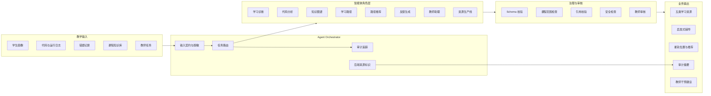
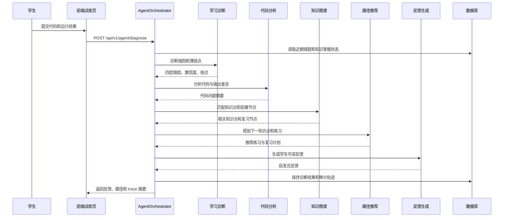

# 多智能体设计说明

**文档编号**：PLEX-A3-MA-03

**版本日期**：2026-07-20

## 1. 文档目标

本文档用于说明 PLEX 多智能体体系的设计目标、角色分工、运行流程、数据契约、课程边界、审核机制、降级策略和项目特色。重点是在说明系统如何把学生画像、课程知识库、代码作答、错题记录、教师审核和学习路径组织成可追踪的教学流水线。

PLEX 的多智能体设计面向 Python 程序设计初学者。系统需要解决的核心问题包括：

1. 如何从学生真实表达、代码运行结果和历史错题中识别学习状态。
2. 如何把诊断结果限定在 Python 入门课程范围内，避免推荐超纲内容。
3. 如何生成能被教师审核、能被学生执行、能被系统追踪的学习资源。
4. 如何在无真实模型凭证或外部服务不可用时保持演示闭环，但不冒充真实在线能力。
5. 如何让评审、教师和管理员看清每一步由哪个角色完成、使用什么后端、产生什么证据。

## 2. 设计定位

PLEX 的多智能体体系定位为教学业务编排层。它位于后端服务层之上，消费学生画像、知识图谱、试炼作答、错题记录和课程知识库，输出资源、诊断、路径、反馈和审核建议。

| 维度 | 通用聊天式 Agent | PLEX 多智能体 |
| --- | --- | --- |
| 输入来源 | 用户临时提问为主 | 学生画像、代码、运行日志、错题、知识点、教师任务、课程知识库 |
| 目标 | 回答问题或完成开放任务 | 支持 Python 初学者学习闭环 |
| 知识边界 | 依赖模型自身知识 | 固定在课程白名单和知识库范围内 |
| 输出形态 | 文本回答为主 | 诊断、资源包、路径、审核意见、反馈、审计摘要 |
| 风险控制 | 多依赖提示词约束 | Schema 校验、引用校验、课程范围校验、教师审核、后端标识 |
| 可追踪性 | 通常较弱 | 保存角色、输入摘要、输出摘要、状态、耗时、后端和失败原因 |

## 3. 总体架构

多智能体能力由后端统一编排，前端只负责发起任务、展示结果和呈现审计摘要。

## 4. 核心设计特点

### 4.1 画像驱动

系统不把学生的一句话当作唯一依据。多智能体链路会综合学生画像、最近错题、知识掌握状态、作答日志和教师任务。画像维度包含学习基础、错误模式、学习目标、学习节奏、解释偏好、认知状态等非敏感学习信号；其他学习行为由后端记录和评价报告补足。

这种设计的特点：同一道题、同一个知识点，对不同学生可以给出不同解释方式、练习难度和下一步路径。例如基础薄弱的学生优先收到前置知识复习和小步练习；目标偏项目实践的学生则会在不超纲的前提下获得更贴近代码实操的资源。

### 4.2 课程白名单约束

PLEX 的推荐范围是 Python 入门课程知识体系。系统维护了 Python 初学者知识节点、禁止推荐的超纲主题、关键词到知识点映射、前置知识关系和练习映射。

课程白名单覆盖 `print 输出`、变量、数字类型、字符串、输入、类型转换、条件分支、循环、列表、字典、函数、文件读取、异常处理、计数统计、累加求和、线性查找、简单排序思想等入门内容。动态规划、图论、高级面向对象、装饰器、协程、元类和复杂算法竞赛等内容属于当前阶段禁止或不推荐范围。

### 4.3 诊断先行

学习诊断智能体围绕 Python 初学者常见问题构建四层错因模型：

1. 语法层：缩进、拼写、括号、冒号、语法结构错误。
2. 规则层：类型转换、循环范围、条件判断、输入输出格式等规则使用错误。
3. 逻辑层：算法步骤、边界条件、变量更新、分支顺序错误。
4. 迁移层：知道单个知识点，但无法迁移到新题或组合场景。

系统同时判断学生是概念未建立，还是掌握了概念但细节写错。这个判断直接影响反馈策略：前者应补概念和例子，后者应给检查清单和边界样例。

### 4.4 启发式编程辅导

试炼编程页配置了面向学生即时辅导的角色：报错分析、代码质量分析、优化建议和自定义辅导。所有角色都遵守不直接给完整答案、不输出可直接通过测试的代码的策略。

该设计符合教学目标：学生需要自己完成推理和修正，系统提供定位问题、检查方向和反思问题，而不是替代学生写代码。输出通常包含引导性问题、检查清单、质量建议或优化方向。

### 4.5 五类资源生成

资源生产线面向同一知识点和同一画像，一次生成多种学习材料：

1. 讲解文档：用于概念理解和示例说明。
2. 思维导图：用于知识结构和关联关系梳理。
3. 分层练习：用于基础、巩固和提高训练。
4. 拓展阅读：用于课后补充，但必须受课程范围约束。
5. 代码实操：用于把知识点落到可运行任务。

五类资源共享同一个画像约束、知识点边界和审核规则。这样可以保证学生看到的讲解、练习和代码任务围绕同一个学习目标展开。

### 4.6 教师审核是发布链路的一部分

质量审核智能体会检查 Schema、引用、课程范围、安全风险、重复内容和代码问题，并给出审核摘要。低置信度、引用不足、课程范围风险或安全风险资源进入教师审核。

教师拥有最终发布、退回、修改和干预判断权。系统保留审核状态和审核意见，避免把模型输出未经确认地交给学生。

### 4.7 审计可追踪

每个智能体步骤应记录角色、契约版本、依赖、输入输出脱敏摘要、耗时、实际后端、模型、状态和失败原因。前端展示审计摘要，管理员可以看到任务后端、成功率、平均耗时、错误数和降级状态。

这使多智能体不是黑盒功能，而成为可解释、可复核的工程链路。

## 5. 智能体角色体系

PLEX 多智能体角色分为三组：学习诊断与路径组、资源生产与审核组、试炼即时辅导组。

### 5.1 学习诊断与路径组

| 角色 ID | 中文名称 | 核心职责 | 输入 | 输出 |
| --- | --- | --- | --- | --- |
| `learning_diagnosis` | 学习诊断智能体 | 识别错误层级、薄弱点、掌握状态和补救方向 | 代码、运行日志、错题、知识掌握状态 | 错因类型、薄弱点、置信度、补救策略 |
| `code_analysis` | 代码分析智能体 | 分析学生代码中的结构、错误、输出差异和可读性问题 | 学生代码、标准输出、错误输出、诊断结果 | 代码问题摘要、风险提示、修改方向 |
| `knowledge_graph` | 知识图谱智能体 | 将当前问题映射到知识点和前置知识 | 当前知识点、弱点、错因、图谱节点状态 | 相关知识点、前置节点、复习节点 |
| `learning_path` | 学习路径智能体 | 生成阶段性学习路线 | 诊断、知识图谱、错题记录、教师任务 | 学习阶段、路径步骤、补救顺序 |
| `path_recommendation` | 路径推荐智能体 | 推荐下一知识点和少量练习 | 薄弱点、前置节点、图谱建议 | 下一知识点、1-3 道练习、复习计划 |
| `feedback` | 反馈生成智能体 | 面向学生生成鼓励但不替代解题的反馈 | 诊断、代码分析、路径建议 | 学生可读反馈、下一步建议 |
| `teacher_assistant` | 教师助理智能体 | 为教师形成班级和学生干预建议 | 班级状态、学生画像、错题与路径 | 干预建议、关注名单、教学动作 |

### 5.2 资源生产与审核组

| 角色 ID | 中文名称 | 核心职责 | 设计重点 |
| --- | --- | --- | --- |
| `profile_interpreter` | 画像解释智能体 | 将学生画像转换为教学约束 | 只使用非敏感学习信号，不推断身份、健康等敏感特征 |
| `knowledge_retriever` | 知识检索智能体 | 检索白名单知识点、章节、案例和引用 | 只在课程知识库范围内取材 |
| `instructional_designer` | 教学设计智能体 | 确定难度、顺序、案例层级和练习层次 | 根据画像和掌握度调整讲解方式 |
| `resource_generator` | 资源生成智能体 | 生成五类结构化学习资源 | 输出需符合资源 Schema |
| `quality_reviewer` | 质量审核智能体 | 检查 Schema、引用、安全、重复和代码问题 | 低置信度或高风险内容进入教师审核 |
| `path_planner` | 路径规划智能体 | 形成星轨位置、推荐理由和下一步学习建议 | 与错题、画像和教师任务联动 |

### 5.3 试炼即时辅导组

| 意图 | 角色名称 | 使用场景 | 输出约束 |
| --- | --- | --- | --- |
| `error_diagnosis` | 报错分析智能体 | 学生运行代码后出现报错或用例未通过 | 给出定位方向、引导问题和检查清单 |
| `code_quality` | 代码质量分析智能体 | 学生希望改进代码结构和可读性 | 给出优点和改进方向，不重写答案 |
| `optimization` | 优化建议智能体 | 学生已完成基本功能后希望提升 | 给出效率或结构优化思路，不输出完整代码 |
| `custom` | 编程辅导智能体 | 学生提出自由问题 | 结合题目和代码上下文启发式回答 |

## 6. 典型运行流程

### 6.1 学生代码诊断流程

### 6.2 个性化资源生产流程

1. 读取学生画像和目标知识点。
2. `profile_interpreter` 将画像转换为教学约束，例如解释偏好、节奏、难度和薄弱点。
3. `knowledge_retriever` 从课程知识库检索白名单知识点、案例、练习和引用依据。
4. `instructional_designer` 设计讲解顺序、案例梯度和练习层级。
5. `resource_generator` 生成讲解文档、思维导图、分层练习、拓展阅读和代码实操。
6. `quality_reviewer` 执行结构、引用、安全、重复和代码检查。
7. 高风险或低置信度资源进入教师审核。
8. `path_planner` 根据资源、画像和错题形成星轨位置和下一步建议。
9. 系统保存任务状态、后端来源、输出摘要和审核状态。

### 6.3 教师干预流程

1. 教师进入班级总览，查看薄弱知识点、待审核资源和学生状态。
2. 教师助理智能体汇总学生画像、错题记录、试炼结果和资源使用情况。
3. 系统给出关注名单、干预理由和建议动作。
4. 教师决定发布试炼、退回资源、补充讲解或调整教学安排。
5. 后续学生作答和反馈结果继续进入画像和路径更新链路。

## 7. 数据契约与审计字段

### 7.1 单步任务审计字段

| 字段 | 说明 | 示例 |
| --- | --- | --- |
| `task_id` | 资源或诊断任务标识 | `res_20260720_001` |
| `agent_id` | 智能体角色标识 | `learning_diagnosis` |
| `contract_version` | 输入输出契约版本 | `v1` |
| `dependencies` | 上一步依赖或知识点依赖 | `profile:v3`, `kp:for-loop` |
| `input_summary` | 脱敏后的输入摘要 | `学生在 range 边界题中 2 个用例失败` |
| `output_summary` | 脱敏后的输出摘要 | `定位为循环边界和规则层错误` |
| `backend` | 实际运行后端 | `crewai`, `mock`, `local_rules`, `iflytek_spark` |
| `model` | 模型或规则标识 | `spark`, `rules`, `none` |
| `status` | 运行状态 | `success`, `error`, `degraded` |
| `latency_ms` | 单步耗时 | `173.8` |
| `error_reason` | 失败原因 | `spark_key_missing` |

### 7.2 输出契约要求

| 输出类型 | 必须字段 | 说明 |
| --- | --- | --- |
| 学习诊断 | 错因层级、弱点、置信度、证据、补救策略 | 支持教师和学生理解为什么给出该建议 |
| 代码分析 | 问题摘要、输出差异、风险点、检查方向 | 不直接输出完整答案 |
| 路径推荐 | 下一知识点、练习列表、复习计划、难度 | 每次只推少量练习，降低学习负担 |
| 资源生成 | 资源类型、内容、知识点、引用、置信度 | 进入审核和发布流程 |
| 教师建议 | 关注对象、干预原因、建议动作、证据 | 支持教师最终决策 |

## 8. 课程范围与知识库约束

### 8.1 允许范围

当前课程范围固定为 Python 程序设计基础，覆盖变量、数据类型、输入输出、类型转换、运算、条件分支、循环、容器、函数、文件读取、异常处理和基础算法思想等内容。

系统推荐和生成资源时，应优先使用以下类型的知识依据：

1. 课程知识点注册表。
2. 知识图谱节点与前置关系。
3. 课程案例、正反例和常见错误。
4. 基础练习与进阶练习。
5. 教师发布的试炼任务和补救任务。

### 8.2 禁止或限制范围

当前阶段不主动推荐动态规划、图论、高级面向对象、装饰器、生成器、协程、元类、异步编程和复杂算法竞赛等内容。若学生主动提问涉及这些内容，系统应优先解释“当前课程阶段暂不展开”，并给出与入门知识相关的替代学习路径。

### 8.3 引用与可解释要求

每个生成资源都应能说明来自哪个知识点、使用了哪些课程依据、为什么适合当前学生。资源如果缺少引用、引用不可靠或与课程范围不一致，应进入审核或被拒绝发布。

## 9. 模型后端与运行时策略

PLEX 支持多种运行状态，但必须清楚标识实际后端。

| 后端状态 | 使用条件 | 输出口径 |
| --- | --- | --- |
| `iflytek_spark` / `spark` | 配置真实讯飞 Spark 凭证并成功调用 | 可作为真实模型调用证据，但需保留请求 ID、延迟和后端记录 |
| `crewai` | `backend/.venv-crewai` 可用，且运行配置允许 CrewAI | 可作为多 Agent 编排运行时，但仍需区分是否调用真实 LLM |
| `mock` | CrewAI 不可用或后端自动降级 | 可用于本地链路演示，不写作真实模型能力 |

## 10. 质量审核与发布控制

| 检查项 | 检查目的 | 处理方式 |
| --- | --- | --- |
| Schema 校验 | 确认输出字段完整、结构可解析 | 不通过则任务失败或重试 |
| 课程范围校验 | 防止资源超出 Python 入门课程边界 | 超纲内容拒绝或转人工审核 |
| 引用校验 | 确认知识依据、章节和案例可追溯 | 引用不足则标记低置信度 |
| 安全校验 | 防止提示注入、敏感信息和不当内容 | 命中风险则阻断或审核 |
| 重复校验 | 避免资源高度重复或无个性化差异 | 降低置信度并提示重生成 |
| 代码检查 | 避免示例代码错误或不可运行 | 标记风险，必要时退回 |
| 教师审核 | 保障最终教学发布质量 | 教师发布、退回、修改或补充说明 |

## 11. 星轨路径与个性化闭环

PLEX 的一个项目特点是星轨式学习路径。它是多智能体输出在学生端的组织方式。

星轨路径由以下数据共同决定：

1. 学生画像中的基础、节奏、偏好和目标。
2. 当前知识点掌握状态。
3. 近期错题和试炼结果。
4. 知识图谱中的前置关系。
5. 教师发布的任务和干预建议。
6. 资源生成与审核结果。

## 12. 学生侧体验设计

学生侧多智能体能力主要体现在少打断、强反馈、不给答案。

| 场景 | 智能体能力 | 学生获得的结果 |
| --- | --- | --- |
| 不知道从哪学 | 画像解释、路径推荐 | 当前适合的知识点和练习 |
| 代码报错 | 报错分析、代码分析 | 报错定位方向和检查清单 |
| 用例未通过 | 学习诊断、反馈生成 | 输出差异、边界条件提示和复习建议 |
| 多次错同一类题 | 错题归因、知识图谱 | 薄弱点和补救路径 |
| 想提高代码质量 | 代码质量分析、优化建议 | 可读性、结构和效率改进方向 |
| 完成阶段任务 | 学习路径、星轨推荐 | 下一阶段目标和练习 |

## 13. 教师侧体验设计

教师侧多智能体能力主要体现在把分散学情变成可操作干预。

| 场景 | 智能体能力 | 教师获得的结果 |
| --- | --- | --- |
| 查看班级整体情况 | 教师助理、知识图谱 | 班级薄弱点、风险学生和待处理事项 |
| 查看单个学生 | 画像解释、学习诊断 | 学生目标、节奏、错因和近期变化 |
| 审核生成资源 | 质量审核、引用校验 | 发布建议、退回理由、风险说明 |
| 发布试炼 | 路径推荐、知识点映射 | 推荐练习方向和任务依据 |
| 设计补救教学 | 错题归因、学习路径 | 分层补救策略和关注顺序 |

## 14. 设计结论

PLEX 的多智能体设计具有明确的教学业务特征，以学生画像为起点，以 Python 课程知识库为边界，以代码诊断和错题证据为依据，以五类学习资源和星轨路径为输出，以教师审核和系统观测为治理手段。
