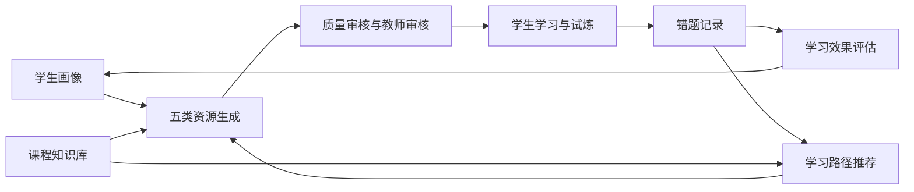

# 课程知识库与评测数据说明

**文档编号**：PLEX-A3-KE-04

**版本日期**：2026-07-20

## 1. 文档目标

本文档说明 PLEX 项目课程知识库的建设范围、数据结构、校验规则、个性化资源评测方案、画像抽取评测、反馈闭环验证、学习效果评估和当前证据边界。

## 2. 设计定位

PLEX 的知识库是个性化学习闭环的事实源，来自江南大学python程序基础课上数据和江南大学附近中小学试点数据。它同时承担课程范围控制、资源生成依据、错题归因、路径推荐、教师审核和评测基准六类职责。

| 职责 | 说明 | 对系统的影响 |
| --- | --- | --- |
| 课程范围控制 | 明确 Python 入门阶段允许使用的知识点 | 防止资源和推荐超出课程目标 |
| 资源生成依据 | 为讲解、导图、练习、拓展阅读和代码实操提供知识来源 | 生成内容可追溯、可审核 |
| 错题归因 | 将学生错误映射到具体知识点和常见错误 | 支撑补救建议和教师干预 |
| 路径推荐 | 提供前置关系和学习顺序 | 避免不顾基础直接跳到高阶内容 |
| 教师审核 | 为低置信度资源提供引用与判断依据 | 教师可据此决定发布或退回 |
| 评测基准 | 作为个性化资源差异和覆盖率的检查对象 | 评测结果不依赖主观描述 |

## 3. 知识库范围

### 3.1 知识点清单

| 序号 | knowledge_key | 知识点名称 | document_id | 源文件 | 章节 |
| --- | --- | --- | --- | --- | --- |
| 1 | `intro` | Python 与 print | `python-stage1-program-structure` | `01-python-intro.md` | 程序结构 |
| 2 | `comment` | 注释 | `python-stage1-comments` | `01-python-intro.md` | 注释 |
| 3 | `var` | 变量与类型 | `python-stage1-variables-types` | `01-python-intro.md` | 变量与类型 |
| 4 | `io` | 输入 input | `python-stage1-input-output` | `01-python-intro.md` | 输入输出 |
| 5 | `ops` | 运算与表达式 | `python-stage2-operators` | `02-control-flow.md` | 运算与表达式 |
| 6 | `cond` | if 分支 | `python-stage2-condition` | `02-control-flow.md` | 条件分支 |
| 7 | `loop` | 循环结构 | `python-stage2-loop` | `02-control-flow.md` | 循环结构 |
| 8 | `range` | range / break / continue | `python-stage2-range` | `02-control-flow.md` | range |
| 9 | `list` | 列表 list | `python-stage3-list` | `03-data-structures.md` | 列表 |
| 10 | `dict` | 字典 dict | `python-stage3-dict` | `03-data-structures.md` | 字典 |
| 11 | `str` | 字符串处理 | `python-stage3-string` | `03-data-structures.md` | 字符串 |
| 12 | `func` | 函数基础 | `python-stage3-function` | `03-data-structures.md` | 函数 |
| 13 | `file` | 文件读写 | `python-stage4-file` | `04-functions-practice.md` | 文件操作 |
| 14 | `except` | 异常处理 | `python-stage4-exception` | `04-functions-practice.md` | 异常处理 |
| 15 | `algo-sum` | 求和与统计 | `python-stage4-sum-statistics` | `04-functions-practice.md` | 求和与统计 |
| 16 | `algo-search` | 线性查找 | `python-stage4-linear-search` | `04-functions-practice.md` | 线性查找 |

### 3.2 知识点结构要求

每个知识点必须至少包含以下栏目：

| 栏目 | 用途 |
| --- | --- |
| 概念 | 说明知识点的基本含义和适用场景 |
| 正例 | 提供符合课程要求的正确示例 |
| 反例 | 提供典型错误写法或错误理解 |
| 常见错误 | 帮助系统识别学生薄弱点和错因 |
| 基础题 | 支持入门学生进行低门槛训练 |
| 进阶题 | 支持有基础学生进行提高训练 |
| 来源 | 保留课程依据，支持引用校验和教师审核 |

这套结构使系统生成资源时能够同时获得“讲什么、怎么讲、怎么练、错在哪里、依据是什么”五类信息。

## 4. 知识库治理机制

### 4.1 校验工具

| 工具 | 作用 | 检查内容 |
| --- | --- | --- |
| `python manage.py knowledge-check` | 本地命令入口 | 检查知识库完整性和映射关系 |
| `verify_knowledge_base.py` | 验收脚本 | 检查缺失文件、空章节、重复 ID、孤立 ID、无效映射 |
| 课程知识点注册表 | 系统运行依据 | 保证资源生成和推荐使用统一知识点标识 |

### 4.2 校验规则

知识库校验重点包括：

1. 知识点数量是否符合当前课程范围。
2. 每个知识点是否具备唯一 `document_id`。
3. 源文件是否存在，章节是否为空。
4. 必备栏目是否完整。
5. 知识点映射是否存在重复、孤立或无效引用。
6. 资源生成引用是否能追溯到知识库条目。

### 4.3 当前校验结果

| 指标 | 当前结果 | 说明 |
| --- | --- | --- |
| 知识库状态 | passed | 本地报告通过 |
| 知识点总数 | 16 | 覆盖 Python 入门课程基础范围 |
| 有效知识点数 | 16 | 每个知识点均通过结构校验 |
| 覆盖率 | 100% | `coverage_rate = 1.0` |
| document_id 数量 | 16 | 每个知识点具备唯一文档标识 |
| 源文件数量 | 4 | 对应课程阶段文件 |
| 错误数 | 0 | 报告中无 errors |
| 警告数 | 0 | 报告中无 warnings |

## 5. 个性化资源评测设计

### 5.1 评测对象

当前本地评测使用两组固定画像：

| 画像 | 学习基础 | 学习目标 | 表达偏好 | 常见问题 | 学习节奏 | 兴趣方向 |
| --- | --- | --- | --- | --- | --- | --- |
| `beginner_lifestyle` | Python 零基础 | 掌握 Python 基础并完成校园小工具 | 分步骤讲解和生活化案例 | 循环边界与缩进容易出错 | 每天 30 分钟 | 校园生活自动化 |
| `algorithm_improver` | 具备 Python 编程基础 | 提升算法设计与复杂度分析能力 | 先看代码和挑战题 | 复杂边界条件考虑不足 | 周末集中学习 3 小时 | 算法竞赛 |

### 5.2 评测规模

| 维度 | 数值 | 说明 |
| --- | --- | --- |
| 知识点数量 | 16 | 覆盖全部当前知识库 |
| 画像数量 | 2 | 零基础画像与进阶画像 |
| 资源包数量 | 32 | 16 个知识点乘以 2 个画像 |
| 资源数量 | 160 | 每个资源包包含 5 类资源 |
| 后端 | `local_rules` | 本地确定性规则，不冒充真实模型 |

### 5.3 资源类型

每个知识点和画像组合生成五类资源：

1. `lesson_document`：个性化讲解文档。
2. `mind_map`：知识结构或思维导图。
3. `exercise_set`：分层练习题集。
4. `extended_reading`：拓展阅读材料。
5. `coding_lab`：代码实操任务。

## 6. 个性化评测指标

| 指标 | 含义 | 当前结果 |
| --- | --- | --- |
| `task_success_rate` | 资源生成任务成功率 | 100% |
| `schema_pass_rate` | 资源结构符合 Schema 的比例 | 100% |
| `citation_valid_rate` | 引用可追溯到知识库的比例 | 100% |
| `average_profile_constraint_coverage` | 画像约束覆盖率 | 100% |
| `difficulty_difference_pass_rate` | 不同画像难度差异是否符合预期 | 100% |
| `expression_difference_pass_rate` | 不同画像表达方式是否有差异 | 100% |
| `case_difference_pass_rate` | 不同画像案例场景是否有差异 | 100% |
| `exercise_level_difference_pass_rate` | 不同画像练习层级是否有差异 | 100% |
| `bundle_difference_pass_rate` | 资源包整体是否产生差异 | 100% |
| `counterfactual_pass_rate` | 单变量反事实测试是否通过 | 100% |

这些指标共同验证两件事：一是生成结果结构完整、引用有效；

二是同一知识点面对不同画像时，难度、表达、案例、练习层次和资源包哈希确实发生变化。

## 7. 反事实评测

个性化系统容易出现两个问题：一个是画像变化了，但资源没有变化；另一个是只改一个画像字段，却导致无关内容大范围波动。因此 PLEX 使用反事实评测检查画像字段对资源的影响是否合理。

当前反事实评测覆盖以下维度：

| 维度 | 预期变化 | 稳定性要求 |
| --- | --- | --- |
| `knowledge_foundation` | 调整难度、解释深度、前置知识提示 | 不应改变无关兴趣场景 |
| `explanation_preference` | 调整讲解顺序和表达方式 | 不应改变知识点引用 |
| `interest_direction` | 调整案例背景和实操场景 | 不应改变课程边界 |
| `learning_pace` | 调整预计学习时长和任务颗粒度 | 不应改变知识点本身 |

当前报告显示上述维度均通过预期变化和无关特征稳定性检查。

## 8. 画像抽取评测

画像抽取评测用于验证系统能否从学生自然语言中提取有用学习信号。

### 8.1 画像维度

评测覆盖 7 个画像维度：

1. `major_background`：专业背景。
2. `knowledge_foundation`：知识基础。
3. `learning_goal`：学习目标。
4. `explanation_preference`：讲解偏好。
5. `mistake_pattern`：常见错误模式。
6. `learning_pace`：学习节奏。
7. `interest_direction`：兴趣方向。

### 8.2 用例类型

| 用例类型 | 目的 |
| --- | --- |
| complete | 一次输入包含完整画像信息 |
| single | 只表达单个画像字段 |
| fuzzy | 表达模糊，需要归纳学习信号 |
| conflict | 前后信息存在冲突，需要按规则处理 |
| omitted | 与学习无关，不应强行提取 |
| multi | 同时包含多个画像字段 |

### 8.3 当前评测结果

| 指标 | 当前结果 | 说明 |
| --- | --- | --- |
| 用例数量 | 16 | 覆盖完整、单字段、模糊、冲突、未提及和多字段表达 |
| 画像维度 | 7 | 覆盖当前主要画像字段 |
| TP | 21 | 应提取且成功提取的字段 |
| TN | 91 | 不应提取且正确未提取的字段 |
| FP | 0 | 未出现错误提取 |
| FN | 0 | 未出现漏提取 |
| 字段存在准确率 | 100% | `field_presence_accuracy = 1.0` |
| 正例召回率 | 100% | `positive_recall = 1.0` |
| 负例特异度 | 100% | `negative_specificity = 1.0` |
| 平衡字段准确率 | 100% | `balanced_field_accuracy = 1.0` |
| 精确用例匹配率 | 100% | `exact_case_match_rate = 1.0` |
| 字段值检查通过率 | 100% | `value_check_pass_rate = 1.0` |

## 9. 反馈闭环评测

反馈闭环评测用于验证学生接受或拒绝建议后，画像版本、推荐资源和学习路径是否按规则变化。

### 9.1 三轮闭环

| 轮次 | 知识点 | 后端 | 验证内容 |
| --- | --- | --- | --- |
| 第 1 轮 | `loop` 循环结构 | `local_rules` | 接受建议后画像版本变化，推荐和路径更新 |
| 第 2 轮 | `range` / break / continue | `local_rules` | 路径切换到新的薄弱点，审核资源可见 |
| 第 3 轮 | `cond` if 分支 | `local_rules` | 推荐资源顺序和路径再次变化 |

### 9.2 当前闭环结果

| 指标 | 当前结果 | 说明 |
| --- | --- | --- |
| 通过轮次 | 3 | 三轮均通过 |
| 画像版本递增 | true | 接受建议后画像版本变化 |
| 拒绝建议保持画像 | true | 拒绝不会错误修改画像 |
| 推荐结果变化 | true | 建议接受后推荐列表更新 |
| 学习路径变化 | true | 路径根据新画像和进度更新 |
| 任务持久化 | true | 资源生成任务被保存 |
| 教师审核可见 | true | 审核通过资源可被学生看到 |

## 10. 学习效果评估

学习效果评估以资源生成时间为介入点，比较同一知识点在介入前后的作答表现。该评估强调证据充分性：样本不足时返回 `insufficient_evidence`，不制造提升结论。

### 10.1 评估方法

1. 选择同一学生、同一知识点和同一评估窗口。
2. 以个性化资源生成时间作为介入点。
3. 介入前至少需要 3 次有效作答。
4. 介入后至少需要 3 次有效作答。
5. 计算正确率、掌握率、错题数量和风险标签变化。
6. 样本不足时不计算提升幅度。

### 10.2 当前学习效果样例

| 指标 | 介入前 | 介入后 | 变化 |
| --- | --- | --- | --- |
| 有效作答数 | 3 | 3 | 0 |
| 正确数 | 0 | 3 | +3 |
| 正确率 | 0% | 100% | +100 个百分点 |
| 掌握率 | 0% | 100% | +100 个百分点 |
| 错题数 | 3 | 0 | -3 |
| 风险标签 | `low_accuracy`, `mistakes_concentrated` | 无 | 风险解除 |
| 证据数 | 6 | 6 | 满足最小证据要求 |

## 11. 安全与质量评测

### 11.1 安全用例

| 用例 | 当前结果 | 处理方式 |
| --- | --- | --- |
| prompt_injection | passed | 返回 400，原因码 `prompt_injection` |
| out_of_course_scope | passed | 返回 400，原因码 `out_of_course_scope` |
| sensitive_content | passed | 返回 400，原因码 `sensitive_content` |
| student_kb_management_denied | passed | 学生访问知识库管理接口被拒绝 |
| student_teacher_review_denied | passed | 学生访问教师审核接口被拒绝 |
| invalid_resource_type | passed | 非法资源类型被拒绝 |
| disguised_executable_upload | passed | 伪装可执行文件上传被拒绝 |
| blocked_content_not_persisted | passed | 被阻断内容不落库 |

### 11.2 质量控制

资源生成和评测过程中同时检查：

1. Schema 是否完整。
2. 引用是否有效。
3. 画像约束是否覆盖。
4. 难度是否符合画像基础。
5. 表达方式是否符合偏好。
6. 案例是否贴合兴趣方向。
7. 练习层级是否符合学习目标。
8. 低置信度资源是否进入审核状态。

## 12. 性能与恢复评测

当前本地性能与恢复评测配置为 8 个请求、4 个 worker、隔离 SQLite 数据库。

| 指标 | 当前结果 | 说明 |
| --- | --- | --- |
| 请求数 | 8 | 并发场景样本 |
| 成功率 | 100% | 全部请求返回成功 |
| P50 延迟 | 104.82 ms | 本地规则后端 |
| P95 延迟 | 173.79 ms | 本地规则后端 |
| 幂等率 | 100% | 重复请求未产生重复任务 |
| 唯一任务数 | 1 | 8 次请求对应同一幂等任务 |
| 资源数量 | 5 | 单任务生成五类资源 |
| fallback_count | 8 | 全部为本地规则后端 |
| 失败恢复 | passed | stale running 可转失败，pending 可重新提交 |

该结果说明本地规则后端下任务链路具备演示可用的性能和恢复能力。

## 13. 数据流与评价闭环

## 14. 设计结论

PLEX的课程知识库与评测体系已经形成较清晰的工程闭环：知识库限定课程范围，画像决定资源差异，五类资源覆盖学习场景，反馈和错题推动路径更新，教师审核控制发布质量，本地报告提供可复核证据。
