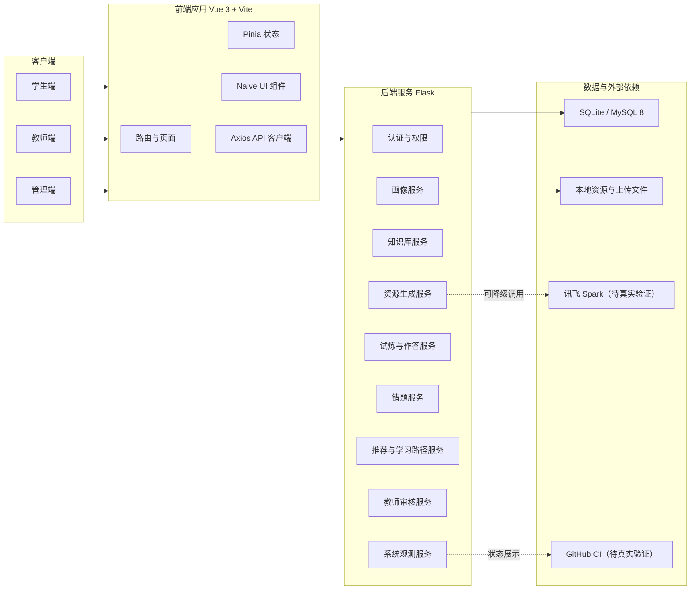
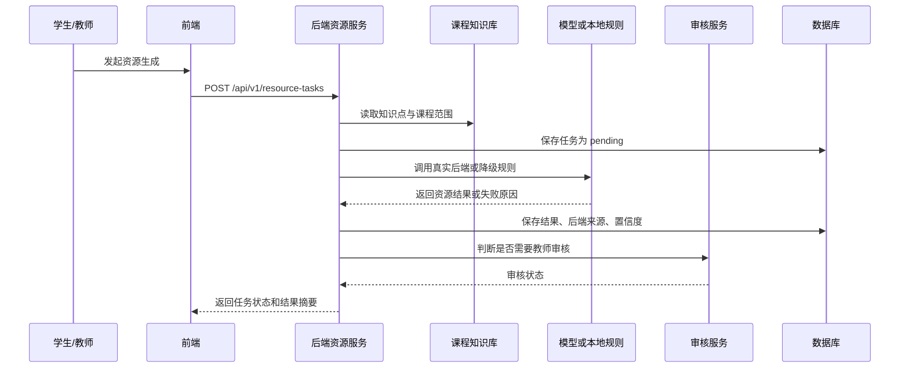

# 系统设计与开发说明

**文档编号**：PLEX-A3-SD-02

**版本日期**：2026-07-20

## 1. 文档目标

本文档说明 PLEX 系统的总体架构、分层职责、核心模块、数据流、接口约束、安全设计、任务处理、部署运行和开发规范，用于支撑研发交接、测试验收和后续迭代。

## 2. 设计原则

| 原则 | 设计要求 | 落地方式 |
| --- | --- | --- |
| 前后端分离 | 前端负责交互和状态组织，后端负责业务规则、数据一致性和鉴权 | Vue 3 + Vite 与 Flask REST API 独立运行，通过 `/api/v1` 通信 |
| 角色边界清晰 | 学生、教师、管理员的数据范围和操作权限必须隔离 | JWT 鉴权、角色校验、班级范围过滤、接口权限装饰 |
| 课程范围可控 | 生成资源必须以课程知识库为边界，避免偏离教学目标 | 知识点索引、引用校验、低置信度审核、教师发布控制 |
| 状态可追踪 | 资源生成、试炼、错题和审核均应保留状态与证据 | 任务记录、画像版本、引用、置信度、审核状态和错误原因 |
| 降级可说明 | 外部模型或平台不可用时，系统应明确标注后端来源和降级模式 | 任务后端字段、local rules 标识、系统观测页面和报告输出 |
| 数据库可移植 | 本地开发可使用 SQLite，生产目标为 MySQL 8 | ORM 建模、避免数据库私有语法、迁移和种子数据分离 |

## 3. 总体架构

PLEX 采用典型三层架构：前端展示层、后端服务层和数据持久层。生成类能力通过后端统一编排。

### 3.1 架构分层

| 层级 | 主要职责 | 技术实现 | 设计约束 |
| --- | --- | --- | --- |
| 展示层 | 页面路由、表单交互、数据展示、错误提示、角色入口 | Vue 3、Vite、Naive UI、Pinia、Axios | 不直接访问数据库，不承载核心权限判断 |
| 接口层 | REST 路由、参数校验、统一响应、错误处理 | Flask Blueprint、JWT 装饰器 | 返回结构稳定 |
| 业务服务层 | 画像、资源、试炼、错题、推荐、审核、观测等业务规则 | Flask 服务模块、领域函数 | 业务规则集中处理 |
| 数据访问层 | ORM 模型、查询、事务、迁移、种子数据 | SQLAlchemy / Flask-SQLAlchemy | 兼容 SQLite 和 MySQL 8，避免不可移植 SQL |
| 外部集成层 | 模型服务、CI 状态、文件处理、降级规则 | 后端适配器与配置项 | 须标注实际后端来源和失败原因 |

## 4. 技术选型说明

| 分类 | 选型 | 选择原因 | 当前状态 |
| --- | --- | --- | --- |
| 前端框架 | Vue 3 | 组件化清晰，适合中小团队交付和课程项目维护 | 已作为正式前端栈 |
| 构建工具 | Vite | 启动快、构建配置简洁，适合本地演示和迭代 | 已使用 |
| UI 组件 | Naive UI | 表格、表单、弹窗、布局组件完整 | 已使用 |
| 状态管理 | Pinia | 与 Vue 3 配套，代码结构轻量 | 已使用 |
| HTTP 客户端 | Axios | 请求拦截、错误处理和鉴权头处理成熟 | 已使用 |
| 后端框架 | Flask | REST API 实现简洁，适合课程项目和轻量服务 | 已使用 |
| ORM | SQLAlchemy / Flask-SQLAlchemy | 便于建模、迁移和数据库可移植 | 已使用 |
| 鉴权 | JWT | 适合前后端分离和多角色访问控制 | 已使用 |
| 本地数据库 | SQLite | 便于本地启动和测试 | 已支持 |
| 目标数据库 | MySQL 8 | 符合生产部署常见选型 | 真实运行待验证 |

## 5. 前端设计

### 5.1 前端职责

前端负责将学生、教师和管理员的业务入口组织为可操作页面，包括登录、学生画像、学习资源、试炼任务、错题反馈、教师总览、学生档案、资源审核和系统观测等能力。

前端不负责以下事项：

1. 不在浏览器端保存敏感密钥。
2. 不绕过后端直接访问数据库或模型服务。
3. 不以页面隐藏作为权限控制的唯一手段。
4. 不在前端伪造外部服务通过状态。

### 5.2 路由与页面结构

| 入口 | 面向角色 | 主要能力 | 设计要求 |
| --- | --- | --- | --- |
| `/student` | 学生 | 学习首页、资源入口、任务提醒、成长状态 | 突出当前任务和下一步建议 |
| `/student/star-path` | 学生 | 知识点导航、学习路径、薄弱点补救 | 与画像和错题数据保持一致 |
| `/teacher` | 教师 | 班级总览、学生状态、待审核事项 | 信息密度适中，便于课堂管理 |
| `/teacher/starfield` | 教师 | 班级学习状态观测 | 支持按薄弱点和学生状态定位 |
| `/teacher/explorers` | 教师 | 学生档案 | 与学生成长档案使用同一事实源 |
| `/trial-arena` | 学生/教师 | 试炼任务、作答和结果 | 任务状态与后端记录一致 |
| `/admin` | 管理员 | 系统观测、风险、降级、配置状态 | 明确展示真实后端和外部阻塞项 |

### 5.3 状态与接口处理

1. Axios 客户端统一追加 JWT 访问令牌。
2. 401、403、404、500 等错误应在前端形成明确提示，不使用空白页面代替错误处理。
3. Pinia Store 负责登录态、用户信息、关键页面状态和跨组件共享数据。
4. 页面组件应从后端接口读取事实数据，不在多个页面维护互相独立的学生表现判断。
5. 教师端和学生端涉及同一学习效果数据时，应调用同一后端服务或统一接口，避免口径不一致。

## 6. 后端设计

### 6.1 后端职责

后端负责认证鉴权、业务规则、数据读写、任务状态、资源生成编排、安全检查和系统观测。所有涉及权限、数据范围、课程范围和资源发布状态的判断应以后端为准。

### 6.2 服务模块

| 模块 | 主要职责 | 关键数据 | 风险控制 |
| --- | --- | --- | --- |
| 用户认证 | 登录、刷新令牌、角色识别、权限校验 | 用户、角色、令牌状态 | JWT 过期、越权访问、未登录访问 |
| 学生画像 | 画像创建、画像版本、画像更新、画像读取 | 画像维度、行为摘要、目标、薄弱点 | 学生只能访问本人画像，教师按班级授权访问 |
| 知识库 | 知识点、层级、引用、课程范围 | 知识点、资源引用、评价标准 | 限制生成内容脱离课程范围 |
| 资源生成 | 任务创建、后端选择、结果保存、失败恢复 | 画像版本、知识点、请求类型、实际后端、置信度 | 标注 local rules、Spark、失败和降级状态 |
| 试炼作答 | 任务发布、学生提交、评分记录、结果反馈 | 试炼题、作答、得分、反馈 | 防重复提交，保留提交记录 |
| 错题管理 | 错题归因、补救建议、复习状态 | 错题、知识点、原因、补救资源 | 与画像和学习路径联动 |
| 推荐路径 | 薄弱点排序、下一步建议、路径更新 | 画像、作答、错题、教师任务 | 推荐依据可解释 |
| 教师审核 | 资源审核、发布、退回、修改意见 | 审核状态、审核人、审核时间 | 未审核高风险资源不对学生发布 |
| 系统观测 | 后端状态、任务成功率、风险、降级、外部依赖 | 任务日志、报告状态、配置状态 | 防止把外部阻塞项显示为已完成 |

### 6.3 接口规范

所有业务接口统一位于 `/api/v1` 下。

1. 请求参数应进行类型、必填项和业务范围校验。
2. 需要登录的接口必须校验 JWT。
3. 教师和管理员接口必须增加角色或权限判断。
4. 返回结构应稳定，便于前端统一处理成功、失败和错误提示。
5. 生成任务类接口必须返回任务标识、状态和实际后端来源。
6. 涉及外部依赖的接口不得隐藏降级或失败原因。

## 7. 数据设计

### 7.1 核心实体

| 实体 | 说明 | 关键字段 |
| --- | --- | --- |
| User | 用户账号与角色 | id、username、role、class_id、status |
| StudentProfile | 学生画像 | student_id、version、level、goal、preference、pace、weaknesses、summary |
| KnowledgePoint | 课程知识点 | id、parent_id、name、level、description、course_scope |
| ResourceTask | 资源生成任务 | id、student_id、profile_version、knowledge_point_id、task_type、backend、status、confidence |
| LearningResource | 学习资源 | id、task_id、resource_type、content、references、review_status |
| Trial | 试炼任务 | id、teacher_id、class_id、title、knowledge_points、status |
| TrialAttempt | 学生作答 | id、trial_id、student_id、answer、score、feedback、submitted_at |
| MistakeRecord | 错题记录 | id、student_id、knowledge_point_id、question、reason、repair_suggestion |
| ReviewRecord | 审核记录 | id、resource_id、teacher_id、decision、comment、reviewed_at |
| SystemObservation | 系统观测记录 | id、backend、success_rate、risk_level、degraded、external_blockers |

### 7.2 数据一致性要求

1. 学生画像应支持版本或更新时间记录，资源生成任务需能追溯到当时使用的画像状态。
2. 学习资源必须关联生成任务，便于追踪后端来源、引用、置信度和审核状态。
3. 错题记录应关联知识点，便于学习路径和教师薄弱点分析复用。
4. 教师审核记录应保留审核人、审核结论和审核时间。
5. 管理观测数据应区分真实服务、本地规则、降级结果和外部阻塞项。

### 7.3 数据库可移植设计

本地环境可使用 SQLite 以降低启动成本；生产目标为MySQL 8。

1. 使用 SQLAlchemy ORM 建模和查询，减少直接拼接 SQL。
2. 避免依赖 SQLite 或 MySQL 独有语法。
3. 时间字段、布尔字段、JSON 字段和文本长度应考虑 MySQL 兼容性。
4. 初始化数据、迁移脚本和演示数据应分离，避免污染生产数据。
5. SQLite 本地通过不等同于 MySQL 8 真实通过，MySQL 8 需在目标环境单独验证。

## 8. 资源生成与审核设计

系统应将学生画像、课程知识点和资源类型作为输入，生成学习资源并保存任务状态。

### 8.1 生成任务流程

### 8.2 审核策略

| 场景 | 处理方式 |
| --- | --- |
| 置信度较高且引用完整 | 可进入待发布或直接展示，具体以教师策略为准 |
| 引用不足 | 标记为待审核，要求教师确认或补充依据 |
| 课程范围越界 | 拒绝发布或退回生成任务 |
| 命中提示注入风险 | 阻断生成结果，记录风险原因 |
| 外部模型不可用 | 使用本地降级规则时必须标记实际后端来源 |

## 9. 学习路径与评价设计

学习路径由学生画像、知识点掌握情况、试炼结果、错题记录和教师任务共同决定。

| 输入 | 用途 |
| --- | --- |
| 学生画像 | 判断学习目标、基础水平和表达偏好 |
| 课程知识点 | 限定推荐范围和学习顺序 |
| 试炼结果 | 衡量当前阶段掌握程度 |
| 错题记录 | 识别薄弱知识点和常见错误类型 |
| 教师任务 | 纳入课堂安排和补救要求 |

教师端学生档案、学生端成长档案、星轨路径和推荐结果应共享同一事实源。

## 10. 安全设计

### 10.1 身份认证与授权

1. 使用 JWT 作为访问令牌。
2. Access Token 用于接口访问，Refresh Token 用于续期。
3. 后端接口按角色校验访问权限。
4. 教师访问学生数据时必须校验班级或管理范围。
5. 管理员接口不应被普通学生或教师访问。

### 10.2 数据安全

1. 学生只能访问自己的学习数据。
2. 教师只能访问所管理班级的数据。
3. 上传文件必须限制类型、大小和路径。
4. 系统不应在前端或提交材料中暴露密钥、Token、数据库密码或第三方服务凭证。
5. 日志和报告应避免输出敏感字段。

### 10.3 内容安全

1. 对提示注入内容进行检测。
2. 对课程范围外内容进行拦截或审核。
3. 对引用缺失或引用不可靠的生成结果进行标记。
4. 高风险资源在教师审核前不应向学生发布。

## 11. 可观测性与降级设计

系统观测模块用于说明当前系统运行状态，而不是单纯展示成功结果。观测内容应包括：

| 观测项 | 说明 |
| --- | --- |
| 任务后端 | 标明使用真实 Spark、本地规则、Mock 或其他后端 |
| 成功率 | 展示生成任务、试炼提交、推荐任务等关键流程的成功情况 |
| 失败原因 | 记录模型不可用、参数错误、权限不足、课程范围越界等原因 |
| 风险等级 | 标记安全风险、引用风险、外部依赖风险 |
| 降级状态 | 标明当前结果是否来自离线降级或本地规则 |
| 外部阻塞项 | 展示讯飞 Spark、GitHub CI、MySQL 8 等待验证状态 |

降级结果可以用于本地演示和核心链路说明，但不能写作真实外部服务通过。

## 12. 部署与运行设计

### 12.1 本地运行

本地入口为根目录 `start.bat`。该脚本用于统一检查和启动项目。

`start.bat --check` 只执行环境检查、迁移检查、种子数据检查、健康检查和演示账号检查，不启动服务。

### 12.2 端口与代理

| 服务 | 默认地址 | 说明 |
| --- | --- | --- |
| 后端 Flask | `http://127.0.0.1:5100` | 提供 `/api/v1` REST API |
| 前端 Vite | `http://localhost:5180` | 开发服务器，代理 `/api` 到后端 |
| API 代理 | 由前端 `.env.development` 配置 | 默认目标为后端 5100 端口 |

### 12.3 环境变量

环境变量用于区分本地开发、演示和生产目标配置。

重点配置包括：
1. 数据库连接地址。
2. JWT 密钥和过期时间。
3. 模型服务后端选择。
4. 第三方模型服务凭证。
5. 上传目录和文件限制。
6. 前端 API 代理目标。

## 13. 测试与验收设计

| 测试类别 | 覆盖内容 | 验收重点 |
| --- | --- | --- |
| 后端接口测试 | 登录、画像、资源、试炼、错题、推荐、审核、观测 | 状态码、返回结构、权限、业务规则 |
| 前端构建测试 | Vite 构建、路由、组件依赖 | 构建通过，无明显资源缺失 |
| 安全测试 | JWT、越权、提示注入、上传安全 | 风险请求被拒绝或标记 |
| 知识库校验 | 知识点、引用、评价规则 | 课程范围和资源依据可追踪 |
| 性能测试 | 关键接口耗时、任务成功率、幂等 | 本地演示可接受，报告口径清楚 |
| 发布准备检查 | 环境、账号、报告、外部阻塞项 | 可说明已完成项和待验证项 |

测试结论应以实际执行记录为准。历史本地报告可以作为阶段性证据，但最终提交前建议复跑关键脚本，避免文档与当前代码状态不一致。

## 14. 设计结论

PLEX 当前系统设计已经形成可说明的前后端分离架构：前端负责多角色交互，后端负责统一鉴权、业务规则、资源生成编排、教师审核、学习路径和系统观测，数据层通过 SQLAlchemy 保持本地 SQLite 与目标 MySQL 的迁移空间。
