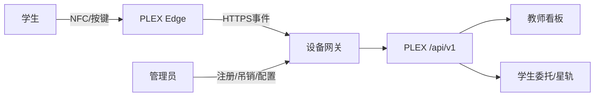

# 系统设计

## 1. 设计目标

PLEX Edge 不承担学习画像计算或大模型推理，只作为课堂触点和状态显示终端。复杂业务、权限、审计和数据存储仍由 PLEX 后端完成。

## 2. 系统边界

## 3. 数据最小化

- 设备只持有 `device_id`、课程会话短标识和短期访问令牌。
- NFC 卡号不得原样上传；应由校内网关做不可逆映射或改用一次性二维码。
- “匿名求助”事件不携带学生标识，只关联教室和会话。
- 学习明细、画像和教师评价不缓存到终端。
- 断网缓存只保存事件类型、会话和本地序号，并设置短期自动删除。

## 4. 设备状态

| 状态 | 灯光 | 屏幕 | 可执行动作 |
|---|---|---|---|
| 未注册 | 红色慢闪 | 显示设备编号 | 管理员注册 |
| 离线 | 黄色慢闪 | 显示离线与缓存数 | 本地排队、重连 |
| 在线空闲 | 青色常亮 | 今日委托/课堂信息 | 签到、反馈 |
| 发送中 | 蓝色呼吸 | 提交中 | 禁止重复触发 |
| 成功 | 绿色短亮 | 已记录 | 返回空闲 |
| 错误 | 红色短闪 | 错误码与重试提示 | 重试或联系教师 |

## 5. 后端改造建议

拟新增设备注册、令牌轮换、事件写入、配置拉取和健康心跳接口。接口应独立于学生 JWT，按学校租户、设备和会话进行授权，并记录管理员操作日志。

